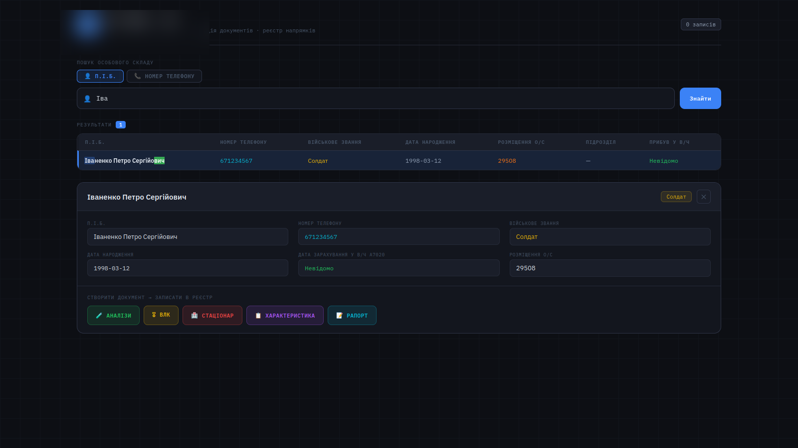
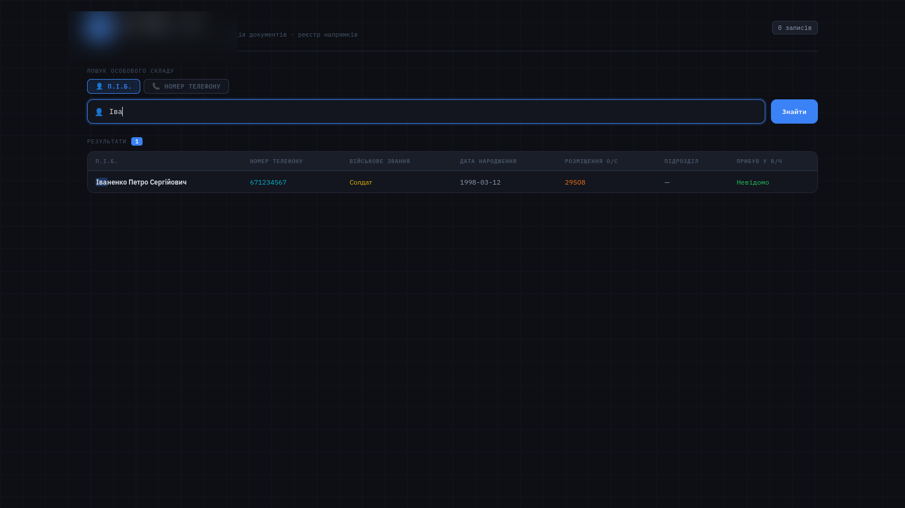
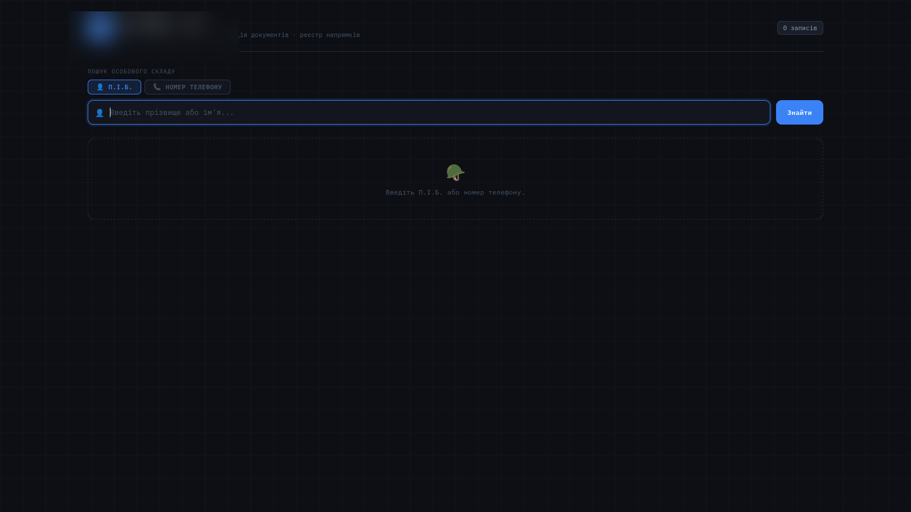

# 📄 Document Automation System


> 📌 **Note:** replace the CI badge above with the real one generated by
> `https://github.com/sergeykeba-cell/document-automation-system/actions/workflows/ci.yml/badge.svg`
> once GitHub Actions runs for the first time.

A web-based tool that automates document generation and personnel management for organizations — import large employee datasets, search instantly, and generate PDF documents in a few clicks.

## Screenshots

<!--
  ⚠️ Verify these images do not contain real personal data (names, IDs, etc.)
  before publishing publicly. If "blurred_*.png" were blurred specifically to
  hide personal data, consider regenerating them with synthetic/demo data
  instead for a cleaner, more shareable README.
-->

| Search | Document generation | Admin panel |
|---|---|---|
|  |  |  |

## Features

- 📂 **Import large Excel files** – handles datasets with 29,000+ records.
- 🔍 **Real-time search** – instantly find employees by name, department, or position.
- 📄 **PDF generation** – create multiple types of documents using ReportLab.
- 📋 **Document registry** – keep track of generated documents, export to Excel.
- 🔐 **Role-based access** – admins and regular users have different permissions.
- 📜 **Audit log** – monitor user actions for security.

## Tech stack

- **Backend:** Python, FastAPI, SQLite
- **Data processing:** pandas, openpyxl
- **PDF generation:** ReportLab
- **Frontend:** HTML, CSS, JavaScript (vanilla)

## Quick start (Docker — recommended)

```bash
git clone https://github.com/sergeykeba-cell/document-automation-system.git
cd document-automation-system
cp .env.example .env        # fill in your own SECRET_KEY, etc.
docker-compose up
```

Open `http://localhost:8000` in your browser.

## Manual setup (without Docker)

1. Clone the repository:
   ```bash
   git clone https://github.com/sergeykeba-cell/document-automation-system.git
   cd document-automation-system
   ```
2. Create a virtual environment and install dependencies:
   ```bash
   python -m venv venv
   source venv/bin/activate   # Windows: venv\Scripts\activate
   pip install -r requirements.txt
   ```
3. Configure environment variables:
   ```bash
   cp .env.example .env
   # edit .env — set SECRET_KEY and DATABASE_URL at minimum
   ```
4. Run the application:
   ```bash
   uvicorn app.main:app --reload
   ```
   <!--
     ⚠️ VERIFY THIS PATH: since the code lives in the `app/` folder, the entry
     point is most likely `app.main:app` rather than `main:app`. Please confirm
     against your actual app/main.py location and adjust if needed — both here
     and in start.sh / start.bat.
   -->
5. Open `http://localhost:8000` in your browser.

Alternatively, use the provided helper scripts:

```bash
./start.sh       # Linux/macOS
start.bat        # Windows
```

## First login / admin access

<!--
  ⚠️ TODO: describe how to create the first admin user — e.g. a seed script,
  a default admin account defined via .env, or a CLI command such as:
  python -m app.cli create-admin --email admin@example.com
-->

## Configuration

All secrets and environment-specific settings are read from environment variables — see [`.env.example`](.env.example) for the full list.

## Contributing

Contributions are welcome! Please read [`CONTRIBUTING.md`](CONTRIBUTING.md) before opening a PR, and check open [issues](https://github.com/sergeykeba-cell/document-automation-system/issues) for ways to help.

## License

Released under the [MIT License](LICENSE).
